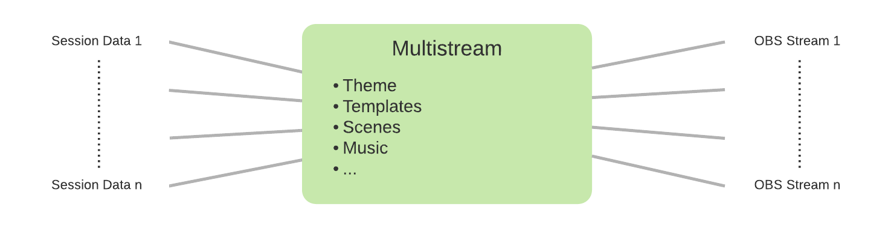

# Multistream

Multistream is a node.js based live streaming tool, which was developed for the [Eurographics'2021](https://conferences.eg.org/eg2021) conference. 
It is designed to work with [OBS Studio](https://obsproject.com/) for streaming multiple parallel streams managed by a central server.
The web server provides pages filled with stream content, such as title cards, videos, etc., which are then displayed in OBS via browser sources.
All content management is done by the server, which allows for the streamers to fully focus on the stream itself.


    
## Installation
Install Node.JS

```shell
git clone https://gitlab.cg.tuwien.ac.at/eg2021/multistream
cd multistream
cp conf.json-dist conf.json # contains the global configuration
npm install
npm start # this will start the NodeJS server, listing for Websocket connections
```

Apache configuration:
```shell
sudo a2enmod proxy proxy_wstunnel
```

```
ProxyPassMatch   "^/stream/socket$" "ws://127.0.0.1:8080/"
```

If you don't have Apache, you can start a webserver on http://localhost:8000/ with the following command:
```
npm run http-server
```

### Development
```
npm run watch # to build OBS scenes and monitor
```

Automatically re-compile dist/app.js when sources change.

Open http://localhost:8000/test.html to play with the scenes.

In `conf.json` you can enable the `developmentMode`. Then you can get some functionlity which is reserved for OBS inside a normal browser window too.

## Usage
When there are multiple sessions defined, you can select the correct session by:

* Appending ?stream=ID to the URL (e.g. on the Prologue; subsequent requests will access the same stream as it will be saved in a cookie)
* Visiting the monitor (index.html): select the stream and click "Register as stream host"
* By default the first non-claimed stream will be assigned to the stream host

Stream Hosts are identified by their IP address.

## OBS Studio configuration
### Import and set up scene collection
* Make sure that the OBS scene collection is up to date (see [Scenes](#scnes))
* In OBS import the scene collection `obs-scene-collection.json` (Scene Collection -> Import -> ... -> choose the file -> Import)
* Select "Multistream Scenes" from the Scene Collection menu
    * Set the image source in the OBS Scene "Error Slide" to use "error_slide.png"
    * Set the source of "Applause File" in the "Live Zoom" scene to the "applause_talk.mp3" file
    * In the Stream Deck applause key set Soundboard File to "applause_talk.mp3"
* Setup the audio capture in OBS to use the system system sound output (Jabra EVOLVE LINK MS)
* Setup the screen capture in OBS capture the secondary display (1920x1080)
* Setup OBS shortcuts (File -> Settings -> Hotkeys) as following:
    * Transition: Strg + Alt + Shift + T
    * Live Zoom No Filter -> Show: Strg + Alt + Shift + F
    * Live Zoom No Filter -> Hide: Strg + Alt + Shift + D
    * Applause File -> Strg + Alt + Shift + A
* Setup OBS to output a full HD stream (File -> Settings -> Video -> Output Resolution -> 1920x1080)

### Set up custom browser dock
* Create a custom browser dock (View -> Docks -> Custom Browser Docks...)
    * Dock Title: "Monitor" 
    * Url: http://localhost:8000 (or your remote server url as specified in `conf.json`)

## Documentation
### Scenes
Scenes are the main components of which a stream is comprised. 
Each scene is a HTML page which also has a corresponding OBS scene.
 
The following default scenes are defined (located in `/scenes` dir):

| HTML File | JS File | Scene Name | Parameters | Description |
|------|------------|------------|-------------|-------------|
| 01prologue.html | src/startPrologue.js | Prologue | start=*ISO 8601 time*: timestamp when session starts; start=now: start prologue now | Scene which precedes the session with countdown. Scene "Prologue Now" is configured in OBS to start the Prologue now. |
| 02sponsoredBy.html | src/startSponsoredBy.js | Sponsored By | | Scen that displays the session sponsor and plays an applause. |
| 03fastForward.html | src/startFastForward.js | Fast Forward | | Scene which cycles through all fast forward videos of the session |
| 04introduction.html | src/startIntroduction.js | Introduction | index=*n* | Introduction for the presenter of the *n*th program point. The index-parameter counts from 0, the scene name from 1 (?index=0 -> Introduction 1) |
| 05video.html | src/startVideo.js | Video | index=*n* | Show the video of the *n*th program point. The index-parameter counts from 0, the scene name from 1 (?index=0 -> Video 1) |
| 06ContinueDiscussion.html | src/startContinueDiscussion.js | Continue Discussion | | Scene which plays an applause and displays where the discussion can continue. |
| 07break.html | src/startBreak.js | Break | | Scene which shows a 20min break slideshow |
| 08epilogue.html | src/startEpilogue.js | Epilogue | | Scene which ends a session |
| template.html | src/startTemplate.js | Template | scene=*name*: Override scene name | Scene with the default background but no content as such. Can be used, when background should be overlayed by OBS sources. |

From these scenes the OBS scene collection is automatically compiled by the `/bin/compile-obs.js` script.  
The naming scheme of scenes is the index (to get the desired scene order in OBS) followed by the name in camelCase. 

#### Adding new Scenes
To add a new scene, two files need to be created: a HTML file in the `/scenes` directory following the naming scheme and a corresponding `startSceneName.js` file in the `/src` directory.  
After creating a new scene the OBS scene collection hast to be re-compiled. To do so either run:

```shell
npm run build
```

to re-build the whole project or 

```shell
npm run build-obs-scene-collection
```
to only re-compile the OBS scene collection.

Additinally the new scene has to be added to the `src/scenes.json` file to register it with the scene testing setup.

#### Testing Scenes
In `test.html` a GUI for testing all scenes is provided, this can be reached by openeing http://localhost:8000/test.html

### Status-Parameter
Each scene will send status updates to the server (and save them to a cookie, in case the server is down). The following properties are used:

* scene: name of the current scene (must equal the scene name in OBS)
* sceneEndTime: timestamp of the end of the scene (if known)
* sceneNext: hint, which scene comes next
* slide: id of the slide within the current scene (if `null`, the other slide-properties will be deleted)
* slideIndex: index of the current slide
* slideTitle: title of the current slide
* slideEndTime: timestamp of the end of the slide (if known)
* programIndex: index of the current program point

### Themes

The appearance of the stream HTML files can be customized using themes which can be defined in the `/themes` directroy. 
A default theme is provieded in the `/default` subdirectory. A documentation on how to create and customize themes can be found [here](/doc/Theme.md)

### Layouts

A layout defines the layout of the screen in regards to the position and size of content, title and additional screen elements. More on layouts can be found [here](/doc/Layout.md) 


    
