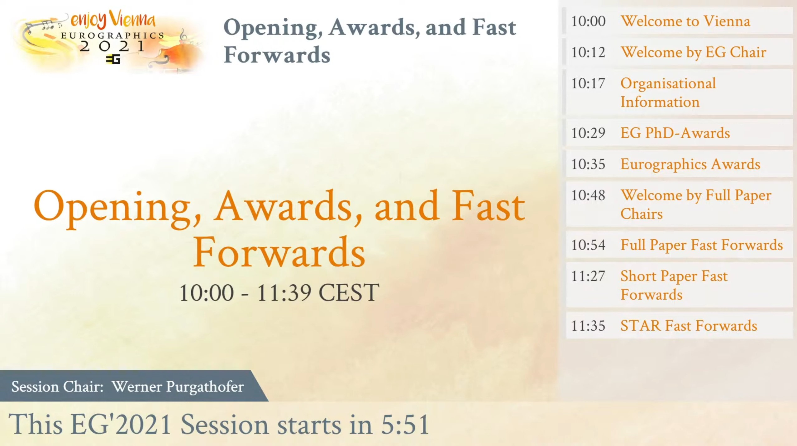

---
  title: Multistream
  author: Johannes Eschner
...

# Overview


Multistream is a node.js based live streaming tool, which was developed for the [Eurographics'2021](https://conferences.eg.org/eg2021) conference. 
It is designed to work with [OBS Studio](https://obsproject.com/) for streaming multiple parallel streams managed by a central server.
The web server provides pages filled with stream content, such as title cards, videos, etc., which are then displayed in OBS via browser sources.
All content management is done by the server, which allows for the streamers to fully focus on the stream itself.


    
# Installation
Install Node.JS

```bash
git clone https://gitlab.cg.tuwien.ac.at/eg2021/multistream
cd multistream
cp conf.json-dist conf.json # contains the global configuration
npm install
npm start # this will start the NodeJS server, listing for Websocket connections
```

Apache configuration:
```bash
sudo a2enmod proxy proxy_wstunnel
```

```bash
ProxyPassMatch   "^/stream/socket$" "ws://127.0.0.1:8080/"
```

If you don't have Apache, you can start a webserver on http://localhost:8000/ with the following command:
```bash
npm run http-server
```

## Development
Automatically re-compile dist/app.js when sources change:
```bash
npm run watch # to build OBS scenes and monitor
```

## Testing
You can manually test the scenes here: http://localhost:8000/test.html.

In `conf.json` you can enable the `developmentMode`. Then you can get some functionality which is reserved for OBS inside a normal browser window too.

The project is also set up for unit testing via [JEST](https://jestjs.io/). At the moment there are only a few example tests available in `/src/test`.
To run the tests use the command:
```bash
npm run test
```

# Usage
## Setting up a Live Stream

This is a complete guide on setting up a live stream from scratch, populating it with data and streaming via OBS.

### Multistream Setup

#### Installation
If you have not already installed it, clone and install Multistream as follows:

Install Node.JS

```bash
git clone https://github.com/cg-tuwien/multistream
cd multistream
cp conf.json-dist conf.json # contains the global configuration
npm install
npm start # this will start the NodeJS server, listing for Websocket connections
```

If you are testing Multistream locally, you do not need to make changes to the`conf.json` file, otherwise replace 'localhost' with your respective URL. 

Apache configuration:
```bash
sudo a2enmod proxy proxy_wstunnel
```

```
ProxyPassMatch   "^/stream/socket$" "ws://127.0.0.1:8080/"
```

If you don't have Apache, you can start a webserver on http://localhost:8000/ with the following command:
```
npm run http-server
```

#### Data Sources
Multistream expects its input data to be in a `/data` directory at the following position:
```
multistream
|_ bin
|_ css
|_ data
   |_ session
|_ music
...
```
Here `session` corresponds to a session in the conference. 
A single session usually contains one or more talks with a video, a fast-forward and a teaser image as well as a session sponsor.
For each session there is a `data.json` file which describes the session program and contains additional metadata such as authors, talk durations and so on.

Data for an example session can be found [here](https://vapor.cg.tuwien.ac.at/index.php/s/xerFxAKyJxeGF3p). 

We will use this dummy session data for our example setup.
Unpack the session data and move it into the `/data` directory (create it if necessary). 
Additionally, if you want to have music playing during the prologue and epilogue slideshows, Multistream expects the music tracks to be located in a `/music` directory.
Read the documentation on [Slideshows](#Slideshows) to see how to set up a music track.

#### Testing your Setup
To test if the setup is working, visit http://localhost:8000/test.html (or your server URL if you are not running it locally), where you can find a web interface that lets you see the different scenes, as they will be displayed in the final stream.
Set the leftmost dropdown to 'Example' to view the example session.
In the 'Scene' dropdown you can now check each scene, while 'Program Point' allows for switching between the talks in the session.
Note that there is a separate program point for the session start called 'Welcome and Introduction', which does not have a video as it is only meant to be a live video.

### OBS Setup

#### Scene Collection
The OBS scene collection is automatically compiled from the scene html files in `/scenes` when you run `npm install`. 
In case you have modified the scenes (see Section Scenes on how to do that), you will have to recompile the scene collection by running

```bash
npm run build
```

to re-build the whole project or 

```bash
npm run build-obs-scene-collection
```
to only re-compile the OBS scene collection.

The scene collection file can then be found in the project root directory under the name `obs-scene-collection.json`

#### Stream Deck
While not necessary for operating Multistream, we found that using a [Stream Deck](https://www.elgato.com/stream-deck) is useful for improving the live streaming workflow.
Since the Stream Deck profiles can only be properly created by the official proprietary software, we cannot provide a profile with Multistream. 
It is, however, very easy to set it up manually. 
We used a profile, where each OBS scene has a dedicated button on the Stream Deck as well as some extra Buttons for playing an applause and enabling/disabling color filters on the 'Live Zoom' scene. 

#### Import and set up Scene Collection
* In OBS import the scene collection `obs-scene-collection.json` (Scene Collection -> Import -> ... -> choose the file -> Import)
* Select "Multistream Scenes" from the Scene Collection menu
    * Set the image source in the OBS Scene "Error Slide" to use "error_slide.png"
    * Set the source of "Applause File" in the "Live Zoom" scene to the "applause_talk.mp3" file
    * In the Stream Deck applause key set Soundboard File to "applause_talk.mp3"
* Setup the audio capture in OBS to use the system sound output
* Setup the screen capture in OBS capture the secondary display (1920x1080)
* Setup OBS shortcuts (File -> Settings -> Hotkeys) as following:
    * Transition: Strg + Alt + Shift + T
    * Live Zoom No Filter -> Show: Strg + Alt + Shift + F
    * Live Zoom No Filter -> Hide: Strg + Alt + Shift + D
    * Applause File -> Strg + Alt + Shift + A
* Setup OBS to output a full HD stream (File -> Settings -> Video -> Output Resolution -> 1920x1080)

#### Set up Custom Browser Dock
* Create a custom browser dock (View -> Docks -> Custom Browser Docks...)
    * Dock Title: "Monitor" 
    * Url: http://localhost:8000/obs-dock.html (or your remote server url as specified in `conf.json`)
    
#### Screen Recording
In order to insert live video sources into the stream, we capture a Zoom meeting via screen capture of a second display. 
This captured video is then overlaid in the OBS scenes 'Live Zoom' and 'Introduction'.

## Streaming the Session
To stream the actual session the following steps need to be taken:

* In the monitor dock select the upcoming session ('Example') from the “Stream” drop down
* In the monitor dock click “Register as Stream Host” (This claims the 'Example' stream on the stream server and allows OBS to control this session stream)
* Make sure that “Current Program point” is set to the first entry in the drop down (In our case 'Welcome and Introduction')
* Select the “Prologue” scene in OBS
* In OBS settings enter this sessions Stream Key
* Click "Start Streaming" in OBS to start the live stream.

### Controls during the Stream
While streaming a session you can control Multistream via two inputs. 
The first is switching between scenes, which you can do directly from OBS (or via a Stream Deck).
To provide the correct data for each program point, you use the OBS Dock.
Here you select the "Current Program Point". 
For example when you want to show the second talk, you choose the according program point and then transition to the "Video" scene.

# Documentation
## Scenes
Scenes are the main components of which a stream is comprised. 
Each scene is a HTML page which also has a corresponding OBS scene.

### Overview
The following default scenes are defined (located in `/scenes` dir):

+--------------+----------------------------------+-----------------------------------+-----------------------------------------------+
| Scene Name   | HTML File / JS File              | Parameters                        | Description                                   |
+==============+==================================+===================================+===============================================+
| Prologue     | 01prologue.html\                 | start=*ISO 8601 time*: timestamp  | Scene, which precedes the session with        |
|              | startPrologue.js                 | when session starts;\             | countdown. Scene "Prologue Now" is            |   
|              |                                  | start=now: start prologue now\    | configured in OBS to start the Prologue now.  | 
+--------------+----------------------------------+-----------------------------------+-----------------------------------------------+
| Sponsored By | 02sponsoredBy.html\              |                                   | Scene, which displays the session sponsor and |
|              | sponsoredBy.js\                  |                                   | plays an applause.\                           |
+--------------+----------------------------------+-----------------------------------+-----------------------------------------------+
| Fast Forward | 03fastForward.html\              |                                   | Scene, which cycles through all fast          |
|              | startFastForward.js\             |                                   | forward videos of the session.\               |
+--------------+----------------------------------+-----------------------------------+-----------------------------------------------+
| Introduction | 04introduction.html\             | index=*n*                         | Introduction for the presenter of the *n*th   |
|              | startIntroduction.js\            |                                   | program point. The index-parameter counts     |
|              |                                  |                                   | from 0, the scene name from 1 (?index=0       | 
|              |                                  |                                   | -> Introduction 1)\                           |  
+--------------+----------------------------------+-----------------------------------+-----------------------------------------------+
| Video        | 05video.html\                    | index=*n*                         | Show the video of the *n*th program point.    |
|              | startVideo.js\                   |                                   | The index-parameter counts from 0, the scene  |
|              |                                  |                                   | name from 1 (?index=0 -> Video 1)\            |   
+--------------+----------------------------------+-----------------------------------+-----------------------------------------------+
| Continue     | 06ContinueDiscussion.html\       |                                   | Scene, which plays an applause and displays   |
| Discussion   | startContinueDiscussion.js\      |                                   | where the discussion can continue.\           |
+--------------+----------------------------------+-----------------------------------+-----------------------------------------------+
| Break        | 07break.html\                    |                                   | Scene, which shows a 20min break slideshow    |
|              | startBreak.js\                   |                                   |                                               |   
+--------------+----------------------------------+-----------------------------------+-----------------------------------------------+
| Epilogue     | 08epilogue.html\                 |                                   | Scene, which ends a session                   |
|              | startEpilogue.js\                |                                   |                                               |   
+--------------+----------------------------------+-----------------------------------+-----------------------------------------------+
| Template     | template.html\                   | scene=*name*: Override scene name | Scene with the default background, but no     |
|              | startTemplate.js\                |                                   | content as such. Can be used, when            |
|              |                                  |                                   | background should be overlaid by OBS sources.\|  
+--------------+----------------------------------+-----------------------------------+-----------------------------------------------+

From these scenes the OBS scene collection is automatically compiled by the `/bin/compile-obs.js` script.  
The naming scheme of scenes is the index (to get the desired scene order in OBS) followed by the name in camelCase.

### Prologue, Break, Epilogue
Prologue, Break and Epilogue are slideshow scenes, which either start automatically when the scene becomes active, or in case of the Prologue 5 minutes before the specified `start` time in the sessions `data.json`.
For these scenes to work, a JSON file, which describes the sequence of slides, must be provided in the theme (see [Slideshows](#slideshows))

### Sponsored By
The Sponsored By scene displays the session sponsor. A session sponsor must be present in the `data.json` for this scene to work:
```json
"sponsored_by": [
    {
        "name": "CG TU Wien",
        "logo": "sponsor0.png"
    }
]
```
Multiple sponsors can be added for a session.

### Fast Forward
This scene plays all fast forward videos present in the `data.json` one after another, each prefaced by an introduction slide.
The display duration of the introduction slide can be specified by setting a value (in seconds) for `fastForwardIntroDuration` in the `data.json` either on program point or per session.

### Introduction
The Introduction scene reserves the left part of the layout for a live video to be inserted, while in the right column info on the current program point is displayed.
The layout template for the introduction can be overwritten in the `data.json` by setting a value for `introductionContentTemplate` either on program point or per session.

### Video
In the Video scene a video or video playlist as specified in the `data.json` is played.
A video program point can be specified as a single video:
```json
{
  "session": {
    "title": "Session Title",
    "start": "2021-01-20T15:30:00",
    "program": [
      {
        "videoFile": "filename.mp4",
        "videoDuration": 1234.5,
        "applause": true
      }
    ]
  }
}
```
Here an applause will be played at the end of the video, if applause is set to `true`.

Alternatively, you can specify a video playlist (see https://github.com/plepe/video-playlist/ for details) as follows:
```json
{
  "session": {
    "title": "Session Title",
    "start": "2021-01-20T15:30:00",
    "program": [ 
      {
        "videoPlaylist": [
          {
            "video": "filename.mp4",
            "videoDuration": 1234.5,
            "actions": [
              {
                "time": 1000,
                "id": "applause"
              }
            ],
            "pauses": [
              {
                "time": "end",
                "duration": 234.5
              }
            ]
          },
          {
            "video": "filename2.mp4",
            "videoDuration": 1234.5
          }
        ]
      }
    ]
  }
}
```

Parameters:

* videoFile: a file in the same directory as data.json
* videoPlaylist: instead of videoFile a playlist
* videoLayout: which layout to use: 'fullscreen' (default), 'bottom-title', 'preview'
* videoTitleTemplate: which template to render for the title container (default: 'bottom-title')
* videoPreviewTemplate: which template to render for the preview container (default: 'preview'), alternatives could be 'playlist'
* videoSessionTitleTemplate: which template to render for the session_title container (default: 'session_title')
* videoContinueNext: if true, automatically continue with the video of the next program point. It will update the `status.slideIndex` value to the index in the playlist

`template` parameters in playlist pauses will be rendered via Twig.

### Continue Discussion
The Continue Discussion scene is intended to be displayed after each video talk. 
While it is displayed an applause sound is played back and a location and time where further discussion can take place is displayed.
The displayed time is the end time of the session.
This location can be specified for each program point in the `data.json` using the `locationDetail` parameter. 
You can also specify an icon for the location using the `locationIcon` parameter. This expects to find and icon in the path `/themes/{{ session.theme }}/icons/`  

```json
"program": [
  {
    "title": "Talk Title",
    "duration": 1000,
    "locationDetail": "Some Location",
    "locationIcon": "locationIcon.png"
  }
]
``` 

### Adding new Scenes
To add a new scene, two files need to be created: an HTML file in the `/scenes` directory following the naming scheme and a corresponding `startSceneName.js` file in the `/src` directory.  
The new scene must also be registered in the `index.json` file by adding it to the `scenes` object there. 
After creating a new scene the OBS scene collection has to be re-compiled. To do so either run:

```bash
npm run build
```

to re-build the whole project or 

```bash
npm run build-obs-scene-collection
```
to only re-compile the OBS scene collection.

Additionally, the new scene has to be added to the `src/scenes.json` file to register it with the scene testing setup.

### Testing Scenes
In `test.html` a GUI for testing all scenes is provided, this can be reached by openeing http://localhost:8000/test.html

## Status-Parameters
Each scene will send status updates to the server (and save them to a cookie, in case the server is down). The following properties are used:

* scene: name of the current scene (must equal the scene name in OBS)
* sceneEndTime: timestamp of the end of the scene (if known)
* sceneNext: hint, which scene comes next
* slide: id of the slide within the current scene (if `null`, the other slide-properties will be deleted)
* slideIndex: index of the current slide
* slideTitle: title of the current slide
* slideEndTime: timestamp of the end of the slide (if known)
* programIndex: index of the current program point

## Themes

The appearance of the stream HTML files can be customized using themes which can be defined in the `/themes` directory. 
A default theme is provided in the `/default` subdirectory. 

Here you can see and example of what Multistream looks like with two different themes applied (note that the basic structure stays the same):

{#id .class width=520px}

{#id .class width=520px}

To see the full EG'2021 Opening Session check out the [YouTube Video](https://www.youtube.com/watch?v=eHETevs6DsM). 

Additional examples of streams can be found on the [Eurographics YouTube channel](https://www.youtube.com/channel/UC0eFwvrB1QYnRqIQVTx4YEw).

The theme is defined on session-level, by adding the desired theme name to the sessions `data.json` as follows: 

```json
{
  "session": {
    "theme": "THEME"
  }
}
```

If no theme is provided in the session `data.json`, the default theme will be used. 
A theme has to be a subdirectory of the `themes` directory and contains a theme `data.json` which contains the basic theme settings.

### Slideshows
Apart from that a theme also contains JSON files for sildeshows such as the Prologue and Epilogue scenes. 
These slideshows are loaded by the respective `startSlideshow.js` (e.g. `startPrologue.js`) when their respective scenes become active. 
A slideshow JSON is defined as follows:

```json
{
  "duration": "00:20:00",
  "slides": [
    {
      "slide": "welcome",
      "title": "Welcome",
      "duration": "00:00:15"
    }
  ],
  "music": {
    "tracks": [
      {
        "file": "04_kaiserwalzer.mp3",
        "title": "Kaiserwalzer",
        "description": "(waltz, op. 437)",
        "composer": "Johann Strauß II",
        "performer": "Wiener Philharmoniker",
        "conductor": "Willi Boskovsky",
        "year": "1962",
        "start": "00:20:00",
        "end": "00:10:00",
        "in": "00:00:00",
        "out": "00:10:00"
      }
    ],
    "fadeDuration": "00:00:10"
  }
}
```
`duration` is the duration of the whole slideshow in `hh:mm:ss`.

Each element of the `slides` array represents a single slide.  
The `slide` parameter corresponds to an HTML file in the `/slides` directory of the theme.  
`title` is a human-readable title for the slide.  
`duration` the time the slide is displayed in `hh:mm:ss`.

`music` contains information on the optional background music, which can be played during a slideshow.  
Each track consists of a file, some metadata used for display, and information on the timing of the track.  
`file` music file located in `/music` directory 
`start` refers to the start time of the track within the slideshow.  
`end` refers to the start time of the track within the slideshow.  
Note that Prologue and Break count down, while Epilogue counts up.  
`in` defines the time within the track where playback should start.  
`out` defines the time whith the track where playback should end.

`fadeDuration` is the length of the music fade out which will take place at the end of the slideshow

### Default Theme

The default theme that comes with Multistream is located in `/themes/default/`. 
It contains simple slideshows for the Prologue, Break, and Epilogue scenes in the respective `prologue.json`, `break.json` and `epilogue.json` files.

The slides for the slideshows are located in the `/slides` directory. 

You can define sponsors in the `data.json` file with four different sponsor levels: platinum, gold, silver and bronze. 
An example sponsor on platinum level is present in the default theme.
Sponsor logos are located in the `/sponsors` directory. For each sponsor you add in the `data.json` you have to add a logo image here.

The `theme.css`file contains CSS variables for customizing the theme (colors, logos, etc.) as well as the CSS for the slideshow slides.

Images used in the slides should be in the `/img` directory.

### Customization

Multistream themes are built for easy customization. You can customize each of the above mentioned aspects of the default theme to create your own theme.

To create a new theme, duplicate the default theme and rename the theme's root directory to you new theme name. 
You will then use this name to specify the theme in a session `data.json` as seen at the beginning of this page.

You can adjust the slideshows of your custom theme using the parameters covered in [Slideshows](#Slideshows). 
A new slide should consist of an HTML file located in `/slides`, which contains an HTML fragment to be inserted into the content element of the respective slideshow scene.
Styles for the slides should be located in the `theme.css`.

For adjusting the base CSS of the theme the following CSS variables in `theme.css` can be adjusted:

```css
:root {
    --main-color: #c6339e;
    --accent-color-1: #ecf0f3;
    --accent-color-2: #e8e8e8;
    --accent-color-2-alpha: #e8e8e800;
    --text-color-1: #54758c;
    --text-color-2: #000000;
    --main-logo: url("../themes/default/logo.png");
    --logo-side: url("../themes/default/img/logo-side.png");
}
```
`main-color` is the primary theme color used for headings and accentuation, it works well when this is a color present in the logo.

The `accent-color` fields denote background colors for containers, such as the bottom title container.

`text-color-1` is the text color for headings such as the session name and for slide titles, while the secondary text color is used for text content.

`main-logo` is a high resolution image of the oragnisation or event logo, which is present in nearly every scene.

`logo-side` is a vertical version of the logo, which is displayed in the `narrow-border` [Layout](#layout). It should have an aspect ratio of about 1:10.

### Layouts

A layout defines the layout of the screen in regards to the position and size of content, title, and additional screen elements.

The slides consist of several containers:

* title_container (next to the logo)
* bottom_container (line on the bottom)
* sidebar_container (on the right side)
* content (main content, depending on slide)

There's a default layout for each scene, set as class in the html file to the body tag ('layout-*layout*`, e.g. 'layout-fullscreen'). The body tag also has a 'data-scene' attribute which declares the scene (and therefore the prefix to use for the templates).

You can override the template for the current scene by setting '*prefix*Layout' either to the program entry or the session. The following layouts are available:

```
layout-full:
 _____________________
|              |      |     # Default layout with smaller content area and additional sidebar 
| Content      | Side |     # Additional logo and title can be displayed above content
|              | Bar  |
|______________|______|
| Bottom Tall         |
|_____________________|

layout-full-content:
 _____________________
|                     |     # Same as layout-full, but without the sidebar
| Content             |
|                     |
|_____________________|
| Bottom Tall         |
|_____________________| 

layout-narrow-border:
 _____________________
|                   |L|     # 95% content, only a small logo on the side and a narrow bottom title
|                   |O|     # Additional logo and title can be displayed above content
| Content           |G|
|                   |O|
|___________________|_|
|_Bottom Narrow_______|

layout-fullscreen:
 _____________________
|                     |     # Displays content over full screen area
|                     |
| Content             |
|                     |
|                     |
|_____________________| 
```  
If you don't want a template to be rendered in the block, use 'none'.

In template.html, you can set a template for the main content: `templateContentTemplate`.

The default templates are defined in `src/layoutTemplates.json`.

```json
{
  "session": {
    "videoLayout": "fullscreen",
    "program": [
      {
        "videoLayout": "full"
      }
    ]
  }
}
```

For each session the layout for prologue, break, and epilogue can be set in the data.json file.
Additionally, the layout can also be changed on a per-slide level in slideshows such as in the Prologue scene, where the signation is displayed in the 'Fullscreen' layout while the other slides use the 'Full' layout.

   

# Server

The Multistream server is responsible for managing session data, delivering data to the streaming clients and logging.

To start the server use the following command:

```bash
npm start
```

## Communication with Clients

The server establishes communication with clients as follows:

### Host is not registered yet
* Host connect
* Server message list of defined streams, e.g. {"streams":["foo","bar"],"date":"2020-01-01T01:01:01.123Z"}
* Host message {host:true} // optionally: stream:"bar"
* Server assigns random stream - will keep until end
* Server message {id:'foo',session:...,status:...,...}
* The last message will be repeated, when the status changes

### Host registers on /
* Host connect
* Server message list of defined streams, e.g. {streams:[foo, bar]}
* Host message {stream:bar}
* Server assigns selected stream to IP
* Server message {id:'bar',session:...,...}
* The last message will be repeated, when the status changes

### Host sends status update
* Host message {status:{scene:...,title:...,...}}
* Server message {id:'bar',session:...,...} to all clients of this stream

### Client
* Client connect
* Server message list of defined streams, e.g. {streams:[foo, bar]}
* Client message {client:true,id:'foo'}
* Server message {id:'foo',session:...,...}
* The last message will be repeated, when the status changes

## Logging

The server creates a `log.csv` file for each session in the session's root directory. 
Here each scene transition is logged with a timestamp. 
Additionally, events such as the start time of the actual live stream within OBS are also logged.
These logs can later be used to automatically cut the video or add custom timestamps for each scene.


    
